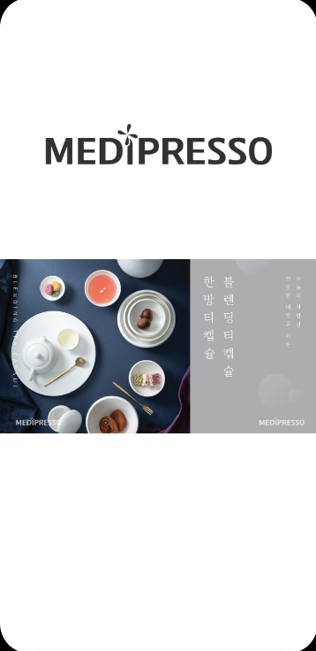
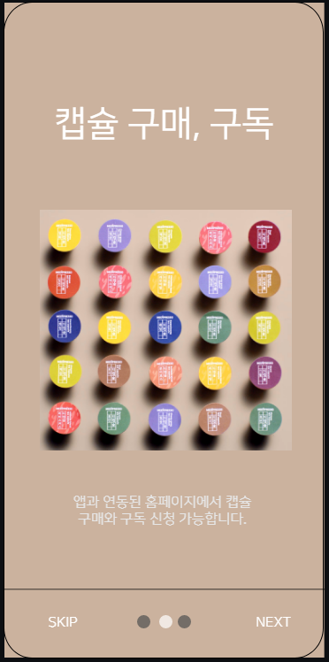
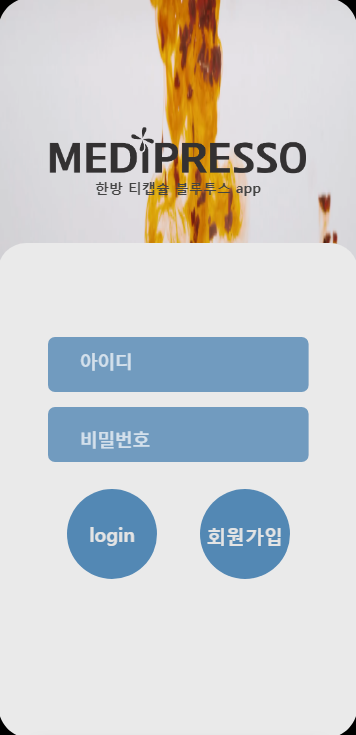
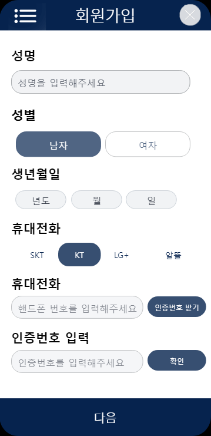
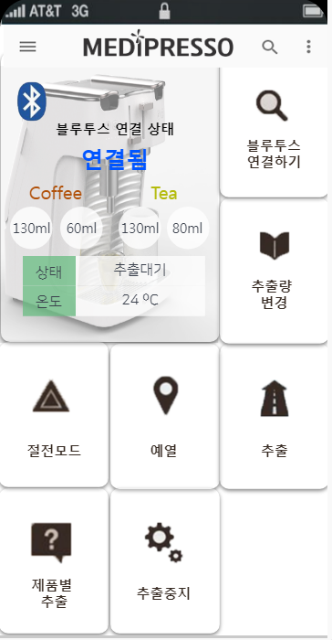
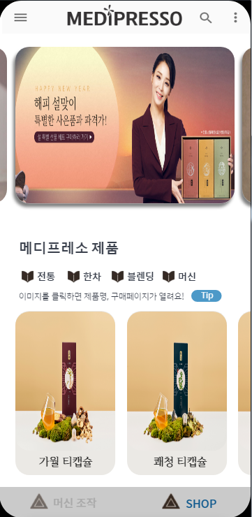
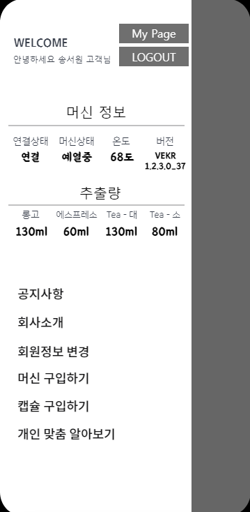
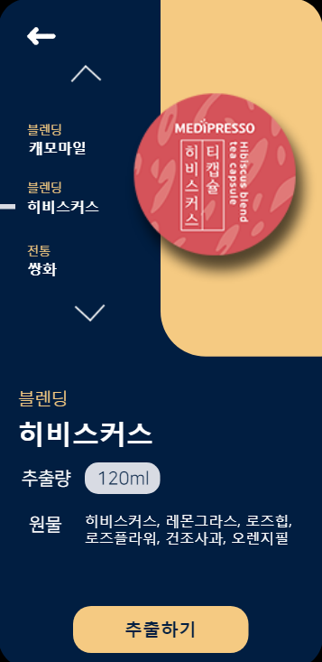
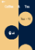

</img> 

***

# BLE센서와 통신하여 원격 조작 가능한 APP

 신규 머신에 들어있는 저전력 블루투스 센서와 연동하여 신규 머신을 조작하고 메디프레소 제품을 구매할 수 있도록 유도 향후 공식 APP이 될 수 있도록 업데이트 진행 예정

***

#개발환경 
 * 안드로이드 스튜디오 
 
 * JSP
 
 * mysql

***

# APP 기능 및 설명에 대한 기획안

 * [APP기획안](https://github.com/2jooho/public_medi_BLE/blob/master/medipresso_app_plan.pdf)

***

#jsp서버 소스

 * [jsp소스](https://github.com/2jooho/public_medi_BLE/tree/server)

***
# APP 기능 소개

1. splash, onboard, 로그인, 회원가입
</img>
</img>
</img>
</img> 

2. 메인1, 메인2, drawer
</img>
</img>
</img> 

3. 제품별추출, 추출버튼
</img>
</img> 

